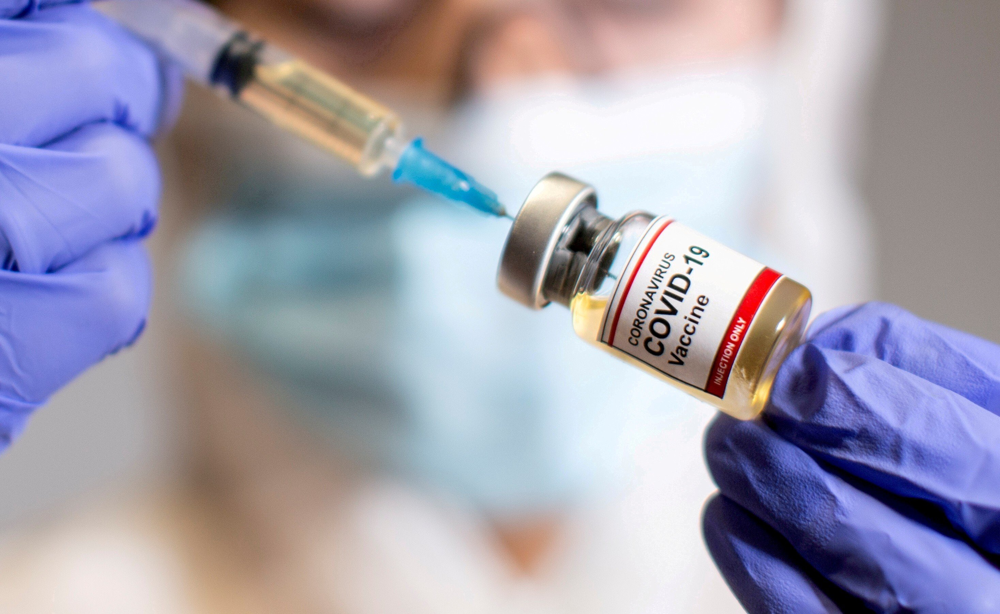

```{r setup, include=FALSE}
knitr::opts_chunk$set(echo = FALSE, message = FALSE, warning = FALSE)
library(tidyverse)
library(plotly)
library(tidyr)
library(gganimate)
library(gifski)
library(DT)
```


# Introduction

This blog explored the status of the world largest economies and well-developed country United States in combating the COVID-19 pandemic. 


# Data description

The data comes from **Our World in Data** on [github](https://github.com/owid/covid-19-data/tree/master/public/data/). The table below is the variables and there corresponding description.

```{r}
owid_covid_data <- readr::read_csv("data/owid-covid-data.csv")
```

```{r}
data_description <- data.frame(Variables = names(owid_covid_data),
                               Description = c("Country code",
                                               "Location of continent",
                                               "Country full name",
                                               "Date of data recorded",
                                               "Number of total confirmed cases",
                                               "New cases recorded on the date",
                                               "New confirmed cases of COVID-19 (7-day smoothed)",
                                               "Number of total confirmed death cases",
                                               "New deaths recored on the date",
                                               "New deaths attributed to COVID-19 (7-day smoothed)",
                                               "Number of totalconfirmed cases per million",
                                               "Number of new recored confirmed cases per million",
                                               "New confirmed cases of COVID-19 (7-day smoothed) per million",
                                               "Number of totalconfirmed death cases per million",
                                               "Number of new recored confirmed death cases per million",
                                               "New deaths attributed to COVID-19 (7-day smoothed) per million",
                                               "Real-time estimate of the effective reproduction rate (R) of COVID-19.",
                                               "Number of ICU patients",
                                               "NUmber of ICU patients per million people",
                                               "Number of COVID-19 patients in hospital on a given day",
                                               "Number of COVID-19 patients in hospital on a given day per 1,000,000 people",
                                               "Number of COVID-19 patients newly admitted to intensive care units (ICUs) in a given week",
                                               "Number of COVID-19 patients newly admitted to intensive care units (ICUs) in a given week per 1,000,000 people",
                                               "Number of COVID-19 patients newly admitted to hospitals in a given week",
                                               "Number of COVID-19 patients newly admitted to hospitals in a given week per 1,000,000 people",
                                               "New tests for COVID-19 (only calculated for consecutive days)",
                                               "Total tests for COVID-19",
                                               "Total tests for COVID-19 per 1,000 people",
                                               "New tests for COVID-19 per 1,000 people",
                                               "New tests for COVID-19 (7-day smoothed)",
                                               "New tests for COVID-19 (7-day smoothed) per 1,000 people",
                                               "The share of COVID-19 tests that are positive, given as a rolling 7-day average (this is the inverse of tests_per_case)",
                                               "Tests conducted per new confirmed case of COVID-19, given as a rolling 7-day average (this is the inverse of positive_rate)",
                                               "Units used by the location to report its testing data",
                                               "Total number of COVID-19 vaccination doses administered",
                                               "Total number of people who received at least one vaccine dose",
                                               "Total number of people who received all doses prescribed by the vaccination protocol",
                                               "Total number of COVID-19 vaccination booster doses administered (doses administered beyond the number prescribed by the vaccination protocol)",
                                               "New COVID-19 vaccination doses administered (only calculated for consecutive days)",
                                               "New COVID-19 vaccination doses administered (7-day smoothed).",
                                               "Total number of COVID-19 vaccination doses administered per 100 people in the total population",
                                               "Total number of people who received at least one vaccine dose per 100 people in the total population",
                                               "Total number of people who received all doses prescribed by the vaccination protocol per 100 people in the total population",
                                               "Total number of COVID-19 vaccination booster doses administered per 100 people in the total population",
                                               "New COVID-19 vaccination doses administered (7-day smoothed) per 1,000,000 people in the total population",
                                               "Government Response Stringency Index: composite measure based on 9 response indicators including school closures, workplace closures, and travel bans, rescaled to a value from 0 to 100 (100 = strictest response)",
                                               "Population in 2020",
                                               "Number of people divided by land area, measured in square kilometers, most recent year available",
                                               "Median age of the population, UN projection for 2020",
                                               "Share of the population that is 65 years and older, most recent year available",
                                               "Share of the population that is 70 years and older in 2015",
                                               "Gross domestic product at purchasing power parity (constant 2011 international dollars), most recent year available",
                                               "Share of the population living in extreme poverty, most recent year available since 2010",
                                               "Death rate from cardiovascular disease in 2017 (annual number of deaths per 100,000 people)",
                                               "Diabetes prevalence (% of population aged 20 to 79) in 2017",
                                               "Share of women who smoke, most recent year available",
                                               "Share of men who smoke, most recent year available",
                                               "Share of the population with basic handwashing facilities on premises, most recent year available",
                                               "Hospital beds per 1,000 people, most recent year available since 2010",
                                               "Life expectancy at birth in 2019",
                                               "A composite index measuring average achievement in three basic dimensions of human development—a long and healthy life, knowledge and a decent standard of living.",
                                               "Excess mortality P-scores for all ages"))

datatable(data_description, options = list(pageLength = 8), class = "cell-border stripe",
          caption = "Variable and variable description")
```
# United States and Covid

To explore the key aspects in terms of the daily confirmed cases, daily confirmed deaths cases and daily hospital cases over time in the US.

```{r}
 owid_covid_data %>% 
  filter(location == "United States")
```


```{r}
trend1 <- owid_covid_data %>%
  mutate(new_hospital = hosp_patients - lag(hosp_patients)) %>% 
  select(c(date, new_cases, new_deaths, new_hospital)) %>% 
  pivot_longer(cols = c("new_cases","new_deaths","new_hospital"),
               names_to = "Type",
               values_to = "cases")
 

colors <- c(new_cases = '#079CF5', new_deaths = '#72BEEC', new_hospital='#C5E5F8')
```

```{r trend}
p1 <- ggplot(trend1, aes(x = date,
             y = cases,
             color = Type)) +
  geom_col(stat = "identity")+
  facet_wrap(~Type, ncol = 1, scales = "free_y")+
  labs(x = "Date",
       y = "Number of cases",
       title = "Number of daily confirmed new, death and hospital cases")+
  scale_x_date(date_breaks = "60 days",date_labels = "%d-%m-%Y")+
  scale_y_continuous(labels = ~scales::number(.,big.mark = ","))+
  scale_fill_manual(values=colors)+
  theme_minimal()+
  theme(axis.text.x = element_text(angle=20, hjust = 1))

ggplotly(p1)
```

New Cases:
- US is experiencing the second major wave of confirmed new cases.
- On 02 Jan 2021, the daily confirmed cases reached the peak of **300462** cases.

New death:
- In general, there is a positive relationship between confirmed daily cases and daily confirmed deaths.
- The first wave of death started from April 2020 while the confirmed cases were relatively low.

New hospital:
- The negative cases of **new_hospital** represented people who no longer need to be monitored in the hospital
- The number of people in hospital was very high, as may people were panicking about the COVID-19.


# Vaccinations in United States



United States has the world leading position in health care, medical treatment and pharmaceuticals markets (Pharmapproach,2020)

There are three authorized and recommended vaccines in US. They are **BioNTech, Pfizer vaccine**, **Johnson & Johnson vaccine** and **Moderna, NIAID vaccine**. (CDC, 2021) According to the Centers for Disease Control and Prevention USA, that all these are safe, effective and reduce the risk of severe illness caused by Covid-19. More information about US vaccination [here](https://www.cdc.gov/coronavirus/2019-ncov/vaccines/index.html).


```{r}
vacc <- owid_covid_data %>% 
  select(c(date, people_fully_vaccinated, people_vaccinated)) %>% 
  filter(date >= "2020-12-20") %>% 
  ggplot(aes(x = date)) +
  geom_area(aes(y = people_vaccinated), fill = "#6DCBDF")+
  geom_area(aes(y = people_fully_vaccinated), fill = "#47A4B8")+
  labs(x = "Date",
       y = "Number of people vaccinated",
       title = "Vaccination status in United States")+
   annotate("text",
           x = as.Date("2021-02-02"),
           y = 200000000,
           label = "vaccinated at least 1 dose",
           color=  "#6DCBDF") +
   annotate("text",
           x = as.Date("2021-02-02"),
           y = 180000000,
           label = "people fully vaccinated",
           color = "#47A4B8") +
  scale_x_date(date_breaks = "60 days",date_labels = "%d-%m-%Y")+
  scale_y_continuous(labels = ~scales::number(.,big.mark = ","))+
  theme(axis.text.x = element_text(angle=20, hjust = 1)) +
  theme_minimal()+
  transition_reveal(date)

animate(plot = vacc, 
        renderer = gifski_renderer(),
        fps = 10)
anim_save("out.gif")
```

This animation demonstrates the vaccination status in the US, with light blue represents people who had vaccinated at lease 1 dose, dark blue of people who had been fully vaccinated.

# Reference

## Packages

C. Sievert. Interactive Web-Based Data Visualization with R, plotly, and shiny. Chapman and Hall/CRC
  Florida, 2020.
  
Hadley Wickham (2021). tidyr: Tidy Messy Data. R package version 1.1.3.
  https://CRAN.R-project.org/package=tidyr
  
Thomas Lin Pedersen and David Robinson (2020). gganimate: A Grammar of Animated Graphics. R package
  version 1.0.7. https://CRAN.R-project.org/package=gganimate
  
Jeroen Ooms (2021). gifski: Highest Quality GIF Encoder. R package version 1.4.3-1.
  https://CRAN.R-project.org/package=gifski
  
Wickham et al., (2019). Welcome to the tidyverse. Journal of Open Source Software, 4(43), 1686,
  https://doi.org/10.21105/joss.01686
  
Yihui Xie, Joe Cheng and Xianying Tan (2021). DT: A Wrapper of the JavaScript Library 'DataTables'. R
  package version 0.18. https://CRAN.R-project.org/package=DT


## Sources

https://www.cdc.gov/coronavirus/2019-ncov/vaccines/different-vaccines.html

https://www.pharmapproach.com/15-astonishing-statistics-and-facts-about-u-s-pharmaceutical-industry/
