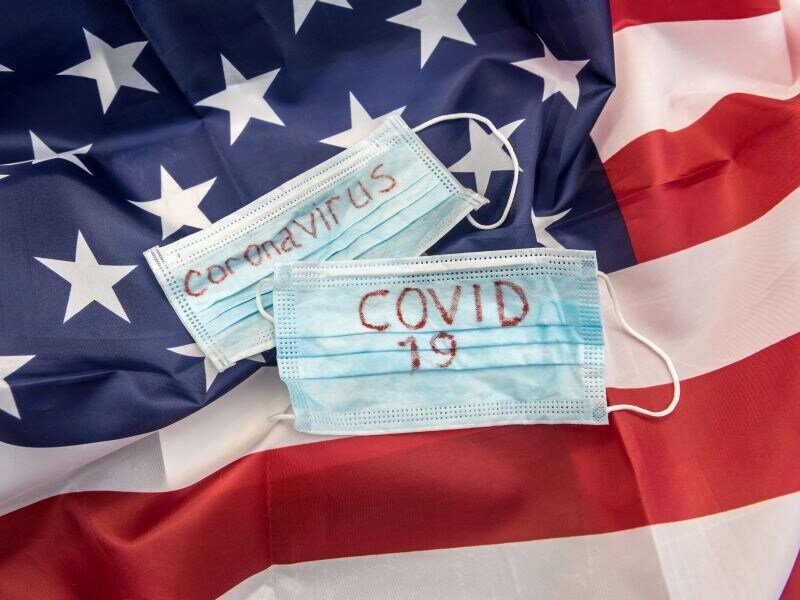

```{r setup, include=FALSE}
knitr::opts_chunk$set(echo = FALSE, message = FALSE, warning = FALSE)
library(tidyverse)
library(plotly)
library(tidyr)
library(gganimate)
library(gifski)
library(DT)
```


# Introduction

This blog explored the status of the world largest economies and well-developed country United States in combating the COVID-19 pandemic. 

Source:Dennis Thompson, Healthday Reporter

# Data description

The data comes from **Our World in Data** on [github](https://github.com/owid/covid-19-data/tree/master/public/data/). The table below is the variables and there corresponding description used for this blog.

```{r}
owid_covid_data <- readr::read_csv("data/owid-covid-data.csv") %>% 
  filter(location == "United States") %>% 
  select(c(location:new_cases,total_deaths:new_deaths,hosp_patients, total_vaccinations:people_fully_vaccinated))
```

```{r}
data_description <- data.frame(Variables = names(owid_covid_data),
                               Description = c("Country full name",
                                               "Date of data recorded",
                                               "Number of total confirmed cases",
                                               "New cases recorded on the date",
                                               "Number of total confirmed death cases",
                                               "New deaths recored on the date",
                                               "Number of COVID-19 patients in hospital on a given day",
                                               "Total number of COVID-19 vaccination doses administered",
                                               "Total number of people who received at least one vaccine dose",
                                               "Total number of people who received all doses prescribed by the vaccination protocol"))

datatable(data_description, options = list(pageLength = 5), class = "cell-border stripe",
          caption = "Variable and variable description")
```
# United States and COVID-19

To have an overview of the impact of COVID-19 in the United States, first by exploring the key aspects in terms of the daily confirmed cases, daily confirmed deaths cases and daily hospital cases over time.

```{r}
trend1 <- owid_covid_data %>%
  mutate(new_hospital = hosp_patients - lag(hosp_patients)) %>% 
  select(c(date, new_cases, new_deaths, new_hospital)) %>% 
  pivot_longer(cols = c("new_cases","new_deaths","new_hospital"),
               names_to = "Type",
               values_to = "cases")
 

colors <- c(new_cases = '#079CF5', new_deaths = '#72BEEC', new_hospital='#C5E5F8')
```

```{r trend}
p1 <- ggplot(trend1, aes(x = date,
             y = cases,
             color = Type)) +
  geom_col(stat = "identity")+
  facet_wrap(~Type, ncol = 1, scales = "free_y")+
  labs(x = "Date",
       y = "Number of cases",
       title = "Number of daily confirmed new, death and hospital cases")+
  scale_x_date(date_breaks = "60 days",date_labels = "%d-%m-%Y")+
  scale_y_continuous(labels = scales::comma)+
  theme_minimal()+
  theme(axis.text.x = element_text(angle=20, hjust = 1),
        legend.key = element_rect(fill = "grey", color = "colors"),
        legend.background = element_rect(fill = "#BCE4EC",
                                         color = "#ADBFC3",
                                         linetype = "dashed"),
        legend.title = element_text(margin = margin(b = "2px")))

ggplotly(p1)
```

From the graph there are some interesting findings:

New Cases:

- US is experiencing the second major wave of confirmed new cases.
- On 02 Jan 2021, the daily confirmed cases reached the peak of **300462** cases.

New death:

- In general, there is a positive relationship between confirmed daily cases and daily confirmed deaths.
- The first wave of death started from April 2020 while the confirmed cases were relatively low.

New hospital:

- The negative cases of **new_hospital** represented people who no longer need to be monitored in the hospital
- The number of people in hospital was very high, as may people were panicking about the COVID-19.


# Vaccinations in United States

Source: Reuters. (2020)

United States has the world leading position in health care, medical treatment and pharmaceuticals markets. (Pharmapproach,2020) There are currently three authorized and recommended vaccines in US. They are **BioNTech, Pfizer vaccine**, **Johnson & Johnson vaccine** and **Moderna, NIAID vaccine**. (CDC, 2021) According to the Centers for Disease Control and Prevention USA, that all these are safe, effective and reduce the risk of severe illness caused by Covid-19. More information about US vaccination [here](https://www.cdc.gov/coronavirus/2019-ncov/vaccines/index.html).

Let's look at the vaccine injection progress in the US

```{r}
vacc <- owid_covid_data %>% 
  select(c(date, people_fully_vaccinated, people_vaccinated)) %>% 
  filter(date >= "2020-12-20") %>% 
  ggplot(aes(x = date)) +
  geom_area(aes(y = people_vaccinated), fill = "#6DCBDF")+
  geom_area(aes(y = people_fully_vaccinated), fill = "#47A4B8")+
  labs(x = "Date",
       y = "Number of people vaccinated",
       title = "Vaccination status in United States")+
   annotate("text",
           x = as.Date("2021-02-02"),
           y = 200000000,
           label = "vaccinated at least 1 dose",
           color=  "#6DCBDF") +
   annotate("text",
           x = as.Date("2021-02-02"),
           y = 180000000,
           label = "people fully vaccinated",
           color = "#47A4B8") +
  scale_x_date(date_breaks = "60 days",date_labels = "%d-%m-%Y")+
  scale_y_continuous(labels = scales::comma)+
  theme_minimal()+
  transition_reveal(date)

animate(plot = vacc, 
        renderer = gifski_renderer(),
        fps = 10)
anim_save("out.gif")
```

This animation demonstrates the vaccination status in the US, with light blue represents people who had vaccinated at lease 1 dose, dark blue of people who had been fully vaccinated. There is a positive trend over time. To incorporate the number of daily confirmed new, death and hospital cases graph, that even US is experiencing the third wave of coronavirus, while the number of death and patients in hospital are lower than previous waves. This may due to the high number of injected vaccines.


# Reference

## Packages

C. Sievert. Interactive Web-Based Data Visualization with R, plotly, and shiny. Chapman and Hall/CRC
  Florida, 2020.
  
Hadley Wickham (2021). tidyr: Tidy Messy Data. R package version 1.1.3.
  https://CRAN.R-project.org/package=tidyr
  
Thomas Lin Pedersen and David Robinson (2020). gganimate: A Grammar of Animated Graphics. R package
  version 1.0.7. https://CRAN.R-project.org/package=gganimate
  
Jeroen Ooms (2021). gifski: Highest Quality GIF Encoder. R package version 1.4.3-1.
  https://CRAN.R-project.org/package=gifski
  
Wickham et al., (2019). Welcome to the tidyverse. Journal of Open Source Software, 4(43), 1686,
  https://doi.org/10.21105/joss.01686
  
Yihui Xie, Joe Cheng and Xianying Tan (2021). DT: A Wrapper of the JavaScript Library 'DataTables'. R
  package version 0.18. https://CRAN.R-project.org/package=DT


## Sources

COVID-19 (2021). Centers for Disease Control and Prevention https://www.cdc.gov/coronavirus/2019-ncov/vaccines/different-vaccines.html

Pharmapproach. (2020). 15 Astonishing Statistics and Facts about U.S. Pharmaceutical Industry
https://www.pharmapproach.com/15-astonishing-statistics-and-facts-about-u-s-pharmaceutical-industry/

Reuters. (2020).
https://www.google.com/url?sa=i&url=https%3A%2F%2Fwww.scmp.com%2Fnews%2Fhong-kong%2Fhealth-environment%2Farticle%2F3112220%2Fhong-kong-raise-fine-breaking-social-distancing&psig=AOvVaw0vEB2ZuuP3vUDxS0_VBCyS&ust=1631717322042000&source=images&cd=vfe&ved=0CAsQjRxqFwoTCKjBye7a_vICFQAAAAAdAAAAABAD

Thompson. D., (2020). COVID-19 causing more stress in America than other nations, survey shows
https://medicalxpress.com/news/2020-08-covid-stress-america-nations-survey.html
